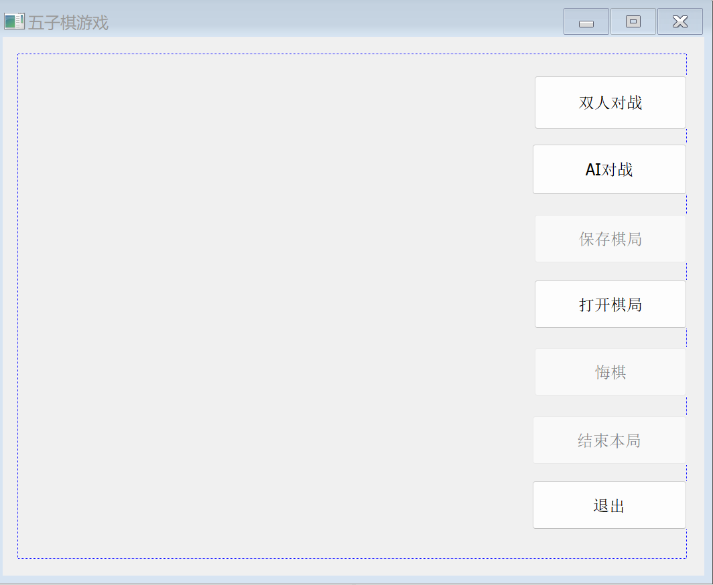

# 项目说明

## 成员及分工
王思图：后端，接口设计，联合调试

张镕州：前端

## 程序功能
本程序实现了基于MFC的图形化五子棋程序，支持人人对弈和人机对弈，同时有保存棋局的功能。


# 具体实现
## 游戏基础知识
参见 http://game.onegreen.net/wzq/HTML/142336.html

根据blog中所写，将上述棋型的得分设置如下
```cpp
const int FIVE_SCORE = 1000; // continuous 5
const int OPEN_FOUR_SCORE = 250; // open 4
const int CLOSE_FOUR_SCORE = 60; // half-open 4, jump 4
const int OPEN_THREE_SCORE = 50; // open 3, jump 3
const int OTHER_SCORE = 3; // half-open 3 or open 2 or jump 2
```
## 算法原理

### MCTS

 蒙特卡洛树搜索（Monte Carlo tree search；MCTS）是一种用于某些决策过程的启发式搜索算法，最引人注目的是在游戏中的使用。一个主要例子是电脑围棋程序，它也用于其他棋盘游戏、即时电子游戏以及不确定性游戏。


- 选择(selection)：根据当前获得所有子步骤的统计结果，选择一个最优的子步骤。从根结点 R 开始，选择连续的子结点向下至叶子结点 L 。一般而言，让游戏树向最优的方向扩展，这是蒙特卡洛树搜索的精要所在。
- 扩展(expansion)：在当前获得的统计结果不足以计算出下一个步骤时，随机选择一个子步骤。除非任意一方的输赢使得游戏在 L 结束，否则创建一个或多个子结点并选取其中一个结点 C。
- 模拟(simulation)：模拟游戏，进入下一步。在从结点C开始，用随机策略进行游戏，又称为playout或者rollout。
- 反向传播(Back-Propagation)：根据游戏结束的结果，计算对应路径上统计记录的值。使用随机游戏的结果，更新从C到R的路径上的结点信息。
- 决策（decision）：当到了一定的迭代次数或者时间之后结束，选择根节点下最好的子节点作为本次决策的结果。


在开始阶段，搜索树只有一个节点，也就是我们需要决策的局面。

搜索树中的每一个节点包含了三个基本信息：代表的局面，被访问的次数，累计评分。

#### 选择

在选择阶段，需要从根节点，也就是要做决策的局面 R 出发向下选择出一个最急迫需要被拓展的节点 N，局面 R 是每一次迭代中第一个被检查的节点；

对于被检查的局面而言，他可能有三种可能：

1. 该节点所有可行动作（即所有子节点）都已经被拓展过
2. 该节点有可行动作（还有子节点）还未被拓展过
3. 这个节点游戏已经结束了(例如已经连成五子的局面)

对于这三种可能：

1. 如果所有可行动作都已经被拓展过，即所有子节点都有了战绩，那么我们将使用 UCB 公式计算该节点所有子节点的 UCB 值，并找到值最大的一个子节点继续向下迭代。
2. 如果被检查的节点 A 依然存在没有被拓展的子节点 B (也即还有战绩为 0/0 的节点)，那么我们认为 A 节点就是本次迭代的的目标节点，紧接着对 A 进行扩展。
3. 如果被检查到的节点是一个游戏已经结束的节点。那么从该节点直接记录战绩，并且反向传播。

##### 优化（！！！重要）
使用**游戏基础知识**中所述的局面评估方法，以及棋子位置等信息计算局面的评估值，排序可选操作，调节某个节点被选择的概率。

如果不加优化，仅适用纯MCTS，会导致结果极差，看起来像乱下。推测原因是15*15的棋盘导致搜索空间奇大，如果仅按UCB选择每个操作基本只能模拟6-7次，非常劣。因此引入手搓的局面评估函数获得先验概率后，再按照先验概率结合UCB进行选择。此方法取自AlpahGo的做法，只不过AlphaGo的评估函数是炼丹炼的，这个是手搓的。


Board类的茫茫多方法都和计算这个局面评估值相关。函数实现翻译了Git上一个项目的Python代码。

https://github.com/marblexu/PythonGobang

#### 扩展

在选择阶段结束时候，我们查找到了一个最迫切被拓展的节点 N，以及他一个尚未拓展的动作 A。在搜索树中创建一个新的节点 $N_A$ 作为N的一个新子节点，$N_A$ 的局面就是节点 N 在执行了动作 A 之后的局面。


#### 模拟

为了让 $N_A$ 得到评分,我们从 $N_A$ 开始，让游戏随机进行，直到得到一个游戏结局，这个结局将作为 $N_A$ 的初始战绩，采用 $\frac{胜场}{总次数}$来记录。

#### 反向传播

 在 $N_A$ 的模拟结束之后，它的父节点 n 以及从根节点到 N 的路径上的所有节点都会根据本次模拟的结果来添加自己的累计评分，注意评分具有交替性。如果在选择阶段直接造成了游戏结局，则跳过模拟，根据该结局来更新评分。

#### 决策

 每一次迭代都会拓展搜索树，随着迭代次数的增加，搜索树的规模也不断增加。当到了一定的迭代次数或者时间之后结束，选择根节点下最好的子节点作为本次决策的结果。本项目采用持续模拟1秒的方法。


### 多线程
采用多线程搜索
参考 https://blog.csdn.net/QLeelq/article/details/115747717

https://blog.csdn.net/gcs_20210916/article/details/128411700

## 基于对话框的MFC程序
### 创建对话框
 在资源视图中依此单击“+”号，展开各个相关，找到Dialog。


 修改给定的对话框：
 在对话框属性中找到描述文字，修改为“五子棋游戏”。
 在工具箱中找到Button控件，根据游戏功能需求拖入合适位置，调整间距，大小，修改名称为“双人对战”、“AI对战”、“保存棋局”、“打开棋局”、“悔棋”、“结束本局”、“退出”。
 
 如下图所示：

### 生成消息响应函数
双击各个控件，在GoBandDlg.h和GoBandDlg.cpp中会自动生成可编辑的函数。


## 代码结构
### GoBandDlg
实现了MFC对话框

1. CGoBangDlg类：对话框类，在程序开始时自动实例化

- afx_msg void OnPaint()：绘图函数，实现棋盘绘制和黑白棋子的绘制。

- afx_msg void OnBnClickedStart()：与双人对战控件对应，点击后开始游戏，在游戏进行时为重开按键

- afx_msg void OnBnClickedQuit()：与退出控件对应，点击后退出游戏，且在对局未结束时加入提醒。

- afx_msg BOOL OnSetCursor(CWnd* pWnd, UINT nHitTest, UINT message)：设置光标函数，在不同轮次中显示相应的黑白光标

- afx_msg void OnBnClickedRepentance()：与悔棋控件对应，点击后返回上一步的棋盘状态。

- afx_msg void OnBnClickedSave()：与保存棋局控件对应，可将未结束的对局以gob文件的形式保存下来。

- afx_msg void OnBnClickedOpen()：与打开棋局控件对应，加载保存下来的棋局继续对战。
```cpp
#define SIZE 15

#include "MCTS.h"
#include "game.h"

class CGoBangDlg : public CDialogEx
{
public:
	CGoBangDlg(CWnd* pParent = nullptr);

#ifdef AFX_DESIGN_TIME
	enum { IDD = IDD_GOBANG_DIALOG };
#endif

protected:
	virtual void DoDataExchange(CDataExchange* pDX);
	bool IsPlaying = false;
	bool AIPlaying = false;
	bool NowColor;
	int ChessBoard[SIZE][SIZE];
	int index;
	CPoint order[SIZE * SIZE];
	int GetChessBoardColor(int ,int);
	void SetChessBoardColor(int ,int,int);
	void EndGame();
	void CleanChessBoard();
	void OpenFile(CString filename);
	int GetChessCount(int,int);
	int GetWinner();
	bool AI_step();
	bool Human_step(CPoint point);
	MCTS ai;
	Game g;

protected:
	HICON m_hIcon;

	virtual BOOL OnInitDialog();
	afx_msg void OnPaint();
	afx_msg HCURSOR OnQueryDragIcon();
	DECLARE_MESSAGE_MAP()
public:
	afx_msg void OnBnClickedStart();
	afx_msg void OnBnClickedQuit();
	afx_msg void OnLButtonUp(UINT nFlags, CPoint point);
	afx_msg BOOL OnSetCursor(CWnd* pWnd, UINT nHitTest, UINT message);
	afx_msg void OnClose();
	afx_msg void OnBnClickedEndgame();
	afx_msg void OnBnClickedRepentance();
	afx_msg void OnBnClickedSave();
	afx_msg void OnBnClickedOpen();
	afx_msg void OnStartAIButtonClicked();
	afx_msg void OnBnClickedButtonAi();
};
```
   
   
### game
实现了游戏逻辑相关部分

1. Board类，存局面等信息，提供判断局面方法，一些自定义格式的转换方法，同时有算分相关方法。

2. GameBase类，最基础的完整游戏逻辑

3. Game类，能悔棋，能记录，能放置，功能完善，傻瓜式一键使用的游戏逻辑接口，前后端用了都说好。
```cpp
class Board
{
public:
	enum Chess;
	enum ChessDirection;
	enum GridType;

	enum ChessPriority;
	Board();

	void Clear();

	bool IsWin(int id);
	bool IsLose(int id);
	void GetGridsByPriority(ChessPriority priority, array<uint8_t, GRID_NUM> &result, int &count);
	int CalcBoardScore(int side);

	void UpdatScoreInfo(int id, int turn);
	
	static int Coord2Id(int row, int col);
	static void Id2Coord(int id, int &row, int &col);
	static bool IsValidCoord(int row, int col);
	static void Direction2DxDy(ChessDirection direction, int &dx, int &dy);
	static int CalcDistance(int id1, int id2);

	static int hitCount;
	static int totalCount;

	uint8_t	keyGrid;
	array<char, GRID_NUM> grids;
	array<short, GRID_NUM> scoreInfo[2];
	array<array<int, GRID_NUM>, 4> keyInfo[2];
	array<char, GRID_NUM> gridCheckStatus;
	array<bool, E_GRID_TYPE_MAX> hasGridType;
	array<bool, E_PRIORITY_MAX + 1> hasPriority;

private:
	char GetGrid(int row, int col);
	bool SetGrid(int row, int col, char value);

	void InitKeyInfo();
	void UpdateKeyInfo(int row, int col);
	void UpdateScore(int row, int col, int rowX, int colX, ChessDirection direction, int side);
	void UpdateScoreOpt(int row, int col, ChessDirection direction, int side);
	void UpdateGridsInfo(int i0);
	void FindOtherGrids(int i0, int id, GridType type);
	static bool RestrictedMoveRule;
	static bool IsRestrictedMove(int id);
	static void InitLineScoreDict(); 
	static short CalcLineScore(array<char, 9> line);
	static array<int, LINE_ID_MAX> lineScoreDict;
	static bool isLineScoreDictReady;
	static array<array<int, GRID_NUM>, 4> keyInfoOrigin;
	static bool isKeyInfoOriginReady;
};

class GameBase
{
public:
	enum State;

	GameBase();
	void Init();
	bool PutChess(int id);
	int GetSide();
	void UpdateValidGrids();
	bool UpdateValidGridsExtra();
	int GetNextMove();
	int CalcBetterSide();

	Board board;
	int state;
	int turn;
	int lastMove;
	int validGridCount;
	array<uint8_t, GRID_NUM> validGrids;
};

class Game : private GameBase
{
public:

	int GetState() { return state; }
	int GetTurn() { return turn; }

	bool PutChess(int id);
	void Regret(int step = 2); // 默认为2，方便人悔棋顺便把AI下的删了
	void Reset();

	const vector<uint8_t>& GetRecord() { return record; }
	static int Str2Id(const string &str);
	static string Id2Str(int id);

private:
	void RebuildBoard();
	vector<uint8_t> record;
};
```

### MCTS
实现了改良版蒙特卡洛树搜索算法

1. TreeNode：树节点，维护分数相关信息

2. MCTS：搜索树
```cpp
class TreeNode
{
public:
	TreeNode(TreeNode *p);
	void Clear();

	int visit;
	float value;
	float winRate;
	float expandFactor;
	int validGridCount;
	int gridLevel;
	GameBase *game;

	TreeNode *parent;
	list<TreeNode*> children;
	array<uint8_t, GRID_NUM> validGrids;
};

class MCTS
{
public:
	MCTS(int mode = 0);
	~MCTS();
	int Search(Game *state);

private:
	static void SearchThread(int id, int seed, MCTS *mcts, clock_t startTime);

	// 标准MCTS
	TreeNode* TreePolicy(TreeNode *node);
	TreeNode* ExpandTree(TreeNode *node);
	TreeNode* BestChild(TreeNode *node, float c);
	float DefaultPolicy(TreeNode *node, int id);
	void UpdateValue(TreeNode *node, float value);

	// 魔改优化
	bool PreExpandTree(TreeNode *node);
	int CheckBook(GameBase *state);
	void ClearNodes(TreeNode *node);
	float CalcScore(const TreeNode *node, float expandFactorParent_c);
	TreeNode* NewTreeNode(TreeNode *parent);
	void RecycleTreeNode(TreeNode *node);
	void ClearPool();
	
	int maxDepth, fastStopSteps, fastStopCount;
	GameBase gameCache[THREAD_NUM_MAX];
	list<TreeNode*> pool;
	TreeNode *root;
	int mode;
};
```

可供调整的参数（在MCTS.cpp中）

```cpp
const float Cp = 2.0f;  // UCB值中的Cp
const float SEARCH_TIME = 1.0f;   // 搜索时间上限
const int	EXPAND_THRESHOLD = 3;   // expand的阈值
const bool	ENABLE_MULTI_THREAD = true;   // 是否使用多线程，建议开启
const float	FAST_STOP_THRESHOLD = 0.1f;   // 剪枝
const float	FAST_STOP_BRANCH_FACTOR = 0.01f;
const bool	ENABLE_TRY_MORE_NODE = true; // 如果模拟太多，换一个点模拟
const int	TRY_MORE_NODE_THRESHOLD = 1000; 
```


# 测试部分
## 人人对弈
使用分支测试，测试了按钮、局面类型的所有可能组合，程序能够正确运行。

又经过自己瞎点了几十局，没有发现任何错误，可以合理推测程序能够在所有局面上正常运行。
## 人机对弈
经过亲自测试，发现AI写的过强，下不过，在几十场对局中人工队取得了$0\%$的好成绩。

# 可能的改进
AI选择难度：通过调整搜索次数，以及局面评估值与模拟值之间的加权比例实现。

选择AI先后手：感觉加入后，从文件加载局面的交互会比较复杂，所以没有加，但AI支持选择先后手，可以通过手动调整代码来选择先后手（bushi）。

# 参考资料
https://zhuanlan.zhihu.com/p/26335999

https://www.nature.com/articles/nature16961/   （校园网免费下载，非常好功能）
